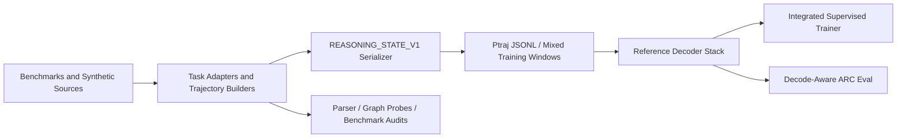
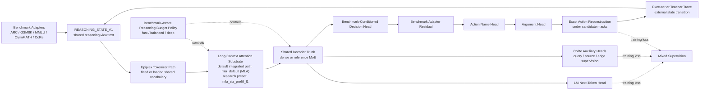

# Current System Spec

This document specifies the system that exists in the repository today.

It is not a target-architecture memo. It describes the currently implemented
benchmark substrate, reasoning-data compiler, reference model stack, training
entrypoints, and export interfaces.

For gap analysis against the intended frontier architecture, see
`docs/spec_alignment.md`.
For a more opinionated review of what should change, see
`docs/full_scale_reasoning_architecture_review.md`.

## 1. Scope

The repository currently implements four main layers:

1. benchmark and task adapters
2. a shared structured reasoning-text interface
3. a reference decoder stack with long-context and MoE experiments
4. supervised and decode-aware evaluation scripts around that stack

The repo should currently be understood as a reasoning-data and benchmark
workspace around a future larger model, not as the finished end-to-end
reasoning system.

## 2. Top-Level Design

## 3. Data and Benchmark Layer

### 3.1 Synthetic ARC

The ARC path is implemented as a synthetic trajectory compiler:

- latent rule sampling in `arc_trajectory_sampler/stage1_latent_sampler.py`
- episode construction in `arc_trajectory_sampler/stage2_episode_sampler.py`
- execution in `arc_trajectory_sampler/stage3_grid_executor.py`
- trajectory expansion in `arc_trajectory_sampler/stage4_trajectory_dataset.py`

This produces stepwise decision traces, alternate valid traces, and near-miss
negatives over structured ARC-like transformations.

This is useful as reasoning-policy supervision and for controlled action-sequence
evaluation. It is not yet a full ARC-AGI-2 solver or a task-time refinement
loop.

### 3.2 GSM8K

`arc_trajectory_sampler/gsm8k_reasoning_parser.py` parses GSM8K into trajectory
records and LM-facing reasoning text.

Current train-safe default:

- uses `train`
- official eval splits require explicit opt-in

The parser is teacher-side supervision, not an inference-time solver.

### 3.3 MMLU

`arc_trajectory_sampler/mmlu_parser.py` parses MMLU-family multiple-choice rows
into structured reasoning traces.

Current train-safe default:

- uses `auxiliary_train`
- benchmark splits remain opt-in

This is the base trainable MMLU path used by the current mixed corpus and the
integrated trainer.

### 3.4 MMLU-Pro and MMLU-Redux

`arc_trajectory_sampler/mmlu_variants.py` adds:

- `MMLU-Pro`
- `MMLU-Redux`

These are wired into the shared interface and the integrated trainer, but they
are currently eval-oriented in the scaffold rather than core pretraining
sources.

### 3.5 OlymMATH

`arc_trajectory_sampler/olympiad_math_parser.py` adapts OlymMATH into the same
trajectory-oriented reasoning interface.

Implemented paths:

- open-answer Olympiad math rows
- `lean` formal-proof concordance rows

Implemented features:

- subject-shaped trace templates
- SymPy-backed canonicalization for scalar, interval, and bracketed-scalar
  targets
- bilingual informal text preservation for `lean`
- Lean theorem/proof artifact preservation for `lean`

For pretraining traces, OlymMATH is split into two source labels:

- `olympiad_math_open`
- `olympiad_math_lean`

### 3.6 CoRe

The CoRe path spans:

- `arc_trajectory_sampler/core_loader.py`
- `arc_trajectory_sampler/core_graph_extractor.py`
- `arc_trajectory_sampler/core_reasoning_adapter.py`

Current CoRe support includes:

- control, data, and infoflow tasks
- query-level `trace` and `list_source` supervision
- prompt-extracted code lines
- explicit graph views
- parser-backed Python AST extraction with heuristic fallback
- aggregated source-set targets
- reconstructed positive traces
- candidate-level source and direct-edge supervision

This is stronger than a plain prompt wrapper, but it is still not a
compiler-grade multi-language CFG/DFG/IFG pipeline.

### 3.7 Oscar Scope Domain Corpus

The repo now also supports both a native domain-corpus path and a deterministic
doc-grounded reasoning-trace path for the Oscar process intelligence spec and
related meeting notes.

The implementation lives in:

- `arc_trajectory_sampler/oscar_scope_corpus.py`
- `arc_trajectory_sampler/oscar_scope_reasoning.py`
- `scripts/export_oscar_scope_corpus.py`
- `scripts/export_oscar_scope_reasoning_corpus.py`

Current behavior:

- prefers text-like sources over PDFs when both exist
- auto-discovers a sibling `oscar_design_docs/` workspace when present
- parses `.tex`, `.md`, `.html`, and `.pdf`
- exports both native content chunks and section-outline views
- derives `REASONING_STATE_V1` terminal-answer traces for section anchoring,
  outline continuation, and canonical concept tagging
- serializes local Oscar graph structure per reasoning trace, including
  document nodes, section nodes, concept nodes, section-parent edges, and
  related-document edges
- trains Oscar-specific pooled auxiliary heads over reasoning traces for
  family, section depth, section path, section-parent links, document group,
  document title, related-document links, and concept tags

The native text path remains the current `Pgen` side for training inside the
Oscar scope as benchmark `oscar_scope`. The reasoning-task path is now a
first-class structured Oscar `Ptraj` benchmark, `oscar_scope_reasoning`, for
doc-grounded supervision.

It now includes two layers:

- document-structure reasoning over section anchors, outline continuation, and
  concept tags
- workflow reasoning over real business environments, including workflow
  environment anchoring, KPI tags, bottleneck tags, improvement tags, and
  KPI-to-improvement supervision drawn from the case-study and PE workflow
  documents
- workflow intervention sequencing, as `decision_action` traces that select a
  focus KPI, choose a primary intervention, and choose a follow-up
  intervention with projected reward score/bucket labels tied to KPI movement
  and bottleneck relief
- a canonical workflow action surface for those executor traces, where the
  decision payloads use shared KPI-family and intervention-family labels
  across environments instead of only environment-specific KPI/intervention
  IDs
- cross-case workflow abstraction, including:
  - case-analogy tasks that identify the shared canonical workflow motif
    between two business cases from different environments
  - transfer tasks that map a successful source-case intervention into the
    best target-case intervention for the analogous KPI/motif setting

The Oscar auxiliary stack for `oscar_scope_reasoning` now also includes
workflow-specific pooled heads for:

- focus KPI prediction
- intervention prediction
- workflow motif prediction
- workflow reward-bucket prediction
- workflow reward-score regression

The repo now also has a focused held-out-domain evaluator,
`scripts/evaluate_oscar_workflow_holdout.py`, that trains on all workflow
traces except one business environment and then evaluates the held-out
environment on:

- structured LM loss over the Oscar workflow traces
- workflow auxiliary metrics, especially KPI, improvement, motif, and reward
  predictions
- strict intervention `decision_action` coverage and accuracy, with the action
  vocabulary learned from non-heldout environments only

That evaluator is the current guardrail against workflow memorization: it
checks whether the model is learning reusable workflow structure or only
environment-specific intervention labels.

### 3.8 Canonical Oscar Graph Benchmark

The repo now also includes a benchmark that reasons directly over the canonical
Oscar process graph rather than only over document-local structure.

The implementation lives in:

- `arc_trajectory_sampler/oscar_graph_reasoning.py`
- `scripts/export_oscar_graph_reasoning_corpus.py`

Current behavior:

- constructs a typed canonical Oscar graph from the local design docs
- represents typed process nodes such as objects, events, contexts, merge
  operators, and recursive graph abstractions
- represents typed canonical relations such as `INVOLVES`, lifecycle links,
  claim-graph links, and graph-of-graphs abstraction links
- derives `REASONING_STATE_V1` traces for:
  - relation classification
  - neighbor enumeration
  - two-hop path completion
  - process-to-graph grounding from Oscar process prose to canonical graph
    nodes
  - executor-style motif rollouts that predict multi-step canonical graph
    traversals plus higher-level process motifs
- exports those traces as a first-class benchmark,
  `oscar_graph_reasoning`
- supports candidate-wise Oscar graph supervision in the trainer for relation
  selection, neighbor-set prediction, two-hop path via/target prediction, and
  process-to-graph grounding
 - supports graph-executor style Oscar supervision in the trainer for rollout
   motif prediction and stepwise canonical node traversal over small process
   motifs

This is the current path by which the repo trains the model to reason inside
the graph structure defined by the Oscar documentation itself, rather than only
over section layout or document metadata.

## 4. Canonical Interfaces

### 4.1 Shared Internal Reasoning IR

`arc_trajectory_sampler/reasoning_ir.py` is the typed task abstraction used by
the reasoning-data side of the repo.

The intent is to preserve:

- typed entities and quantities
- explicit goals
- explicit program structure
- explicit trace templates

### 4.2 Trajectory Record

`TrajectoryRecord` in `arc_trajectory_sampler/stage4_trajectory_dataset.py`
remains the core stepwise supervision object for trajectory-style tasks.

### 4.3 LM-Facing Structured Text

The canonical LM-facing format is `REASONING_STATE_V1`, specified in
`docs/unified_reasoning_lm_interface.md` and implemented at the serializer
boundary in `arc_trajectory_sampler/state_adapter.py`.

The current design intent is:

- prefill-heavy context
- short decoded continuations
- action-oriented outputs like `target_action=...`
- externalized state transitions

### 4.4 `ReasoningTextExample`

`arc_trajectory_sampler/mixed_reasoning_dataset.py` defines
`ReasoningTextExample` as the main cross-benchmark text example object.

Current fields:

- `benchmark`
- `text`
- `trajectory_id`
- `step_index`
- `trace_step`
- `auxiliary_targets`

### 4.5 `Ptraj` Export Format

`scripts/export_ptraj_corpus.py` writes a mixed pretraining manifest as JSONL.

Each row currently contains:

- `benchmark`
- `trajectory_id`
- `step_index`
- `trace_step`
- `text`
- `auxiliary_targets`

This is the main corpus-export surface for continued pretraining on structured
reasoning traces.

### 4.6 Implemented Novel Interface Elements

The most architecture-specific interface ideas currently implemented in the repo
are:

- a shared `REASONING_STATE_V1` reasoning-view format across ARC, GSM8K, MMLU,
  MMLU-Pro, MMLU-Redux, OlymMATH, and CoRe
- an explicitly externalized transition boundary where the model predicts short
  action-like or answer-like targets and the executor or teacher trace advances
  state
- stable lexical-atom oriented serialization rules for the outer prompt shell,
  with structured payloads pushed to short leaf fields
- a mixed `Ptraj` export path that preserves benchmark identity, trajectory
  identity, step index, and benchmark-specific auxiliary targets under one text
  interface

These are not just formatting conveniences. They are the main mechanism by
which the repo tries to share one decoder stack across very different reasoning
benchmarks without forcing them into one benchmark-specific executor.

## 5. Mixed Corpus Layer

`arc_trajectory_sampler/mixed_reasoning_dataset.py` now exposes a mixed-`Ptraj`
builder that can combine:

- ARC synthetic traces
- GSM8K train traces
- benchmark-safe MMLU `auxiliary_train` traces
- OlymMATH open and `lean` traces
- CoRe query-level traces
- Oscar doc-grounded reasoning traces
- Oscar canonical graph reasoning traces

The current mixed export path is:

- `scripts/export_ptraj_corpus.py`

The existing benchmark-specific export path for OlymMATH only is:

- `scripts/export_olympiad_math_trace_corpus.py`

The current native-domain export path for the Oscar scope is:

- `scripts/export_oscar_scope_corpus.py`

The current canonical-graph export path for Oscar is:

- `scripts/export_oscar_graph_reasoning_corpus.py`

## 6. Model Layer

### 6.1 Decoder Stack

The reference model stack lives in `models/`.

It is a decoder-only transformer substrate with:

- grouped-query attention
- RoPE
- KV caching
- RMSNorm
- gated MLP blocks
- configurable inference budgets

This stack is intended for local experimentation and comparison, not as a
production frontier implementation.

### 6.2 Attention Backends

Current attention backend names:

- `eager`
- `sdpa`
- `hybrid`
- `mla`
- `sia`
- `sia_hybrid`
- `mla_sia`

Implemented experiments include:

- local-global hybrid sparse masking
- MLA-inspired latent-KV compression
- scale-invariant score modification
- MLA + SIA hybrid
- suffix-only SIA routing
- prefill-only SIA decode routing

### 6.3 Named Attention Presets

Current named presets:

- `mla_default`
- `mla_sia_prefill_l1`

Interpretation:

- `mla_default` is the current default preset for the integrated trainer and
  the saved integrated experiments in this repo; it resolves to plain `mla`
  without SIA
- `mla_sia_prefill_l1` is the research comparison preset; it resolves to
  `mla_sia` with `scale_invariant_last_n_layers=1` and
  `scale_invariant_decode_mode=prefill_only`

So the architectural surface includes MLA+SIA, but the main integrated
training/evaluation path used so far is still `mla_default`, not
`mla_sia_prefill_l1`.

### 6.4 Sparse MoE Path

The reference sparse path is a feedforward MoE option in `models/`.

Current MoE features:

- configurable expert count
- configurable experts-per-token routing
- router jitter
- auxiliary routing loss

This is a reference sparse backbone surface, not yet a production sparse-MoE
recipe with large-scale stability work or sparse kernels.

### 6.5 Reasoning Budget Policy Layer

`models/reasoning_budget.py` adds benchmark-aware effort presets.

Current effort labels:

- `fast`
- `balanced`
- `deep`

Current benchmark coverage:

- `arc`
- `gsm8k`
- `mmlu`
- `mmlu_pro`
- `mmlu_redux`
- `core`
- `olympiad_math`
- `oscar_scope`
- `oscar_scope_reasoning`
- `oscar_graph_reasoning`
  This now includes both terminal-answer graph reasoning tasks and multi-step `decision_action` executor traces with stable `trajectory_id` / `step_index` state.

The budget policy currently controls:

- active layer fraction
- prompt token limit
- generation length
- cache buffer
- attention window
- KV-cache usage
- ARC structured-decode hint

This is rule-based today, not learned.

### 6.6 Auxiliary Heads

The current supervised stack also includes:

- CoRe auxiliary heads in `models/core_auxiliary.py`
- Oscar auxiliary heads in `models/oscar_auxiliary.py`
- Oscar graph auxiliary heads in `models/oscar_graph_auxiliary.py`
- benchmark-specific decision-action heads in `models/decision_auxiliary.py`

These heads currently support:

- example-level CoRe query metadata prediction
- candidate-level CoRe source membership
- candidate-level CoRe direct-edge supervision
- candidate-level Oscar graph relation selection
- candidate-level Oscar graph neighbor-set prediction
- candidate-level Oscar graph path via/target prediction
- candidate-level Oscar graph grounding to canonical nodes
- candidate-level Oscar graph rollout-step prediction
- Oscar graph motif classification over executor-style rollouts
- factorized action-name / argument prediction for benchmark-specific decision
  decoding
- exact full-action recovery by recomposing benchmark-local name and argument
  logits under candidate masks
- benchmark-conditioned residual adapters over the shared decision projection
  space

The decision path is intentionally not a single flat action softmax over all
benchmarks. It is structured as:

1. shared decoder trunk
2. pooled decision representation
3. optional benchmark-conditioned adapter
4. benchmark-local action-name head
5. benchmark-and-name-local argument head
6. exact-action reconstruction over the candidate set

That factorization is one of the main architectural bets in the current repo,
because it preserves sharing in the trunk while avoiding a global action label
space across ARC, GSM8K, MMLU-family tasks, and OlymMATH.

### 6.7 Implemented Novel Architecture Elements

The currently implemented architectural novelties, relative to a plain
decoder-only multi-task training loop, are:

- a reference long-context attention stack that combines MLA-inspired latent-KV
  compression, scale-invariant score modification, and an MLA+SIA hybrid path
- benchmark-aware reasoning-budget presets that alter active-layer fraction,
  prompt budget, cache budget, and decode hints by task family
- benchmark-conditioned structured decision heads rather than a single shared
  classification head
- mixed supervision that combines LM next-token loss, benchmark-local
  decision-action loss, and CoRe auxiliary graph/query losses in one decoder
  stack
- an Epiplex-aligned tokenizer path for the reference training entrypoints,
  with fitted or loadable vocabularies rather than a fixed byte vocabulary
- explicit separation between the LM policy surface and executor-side state
  transition

In the current repo, the most novel part of the architecture is not the raw
transformer block. It is the combination of:

- shared reasoning-view text
- benchmark-conditioned control over compute and outputs
- structured auxiliary supervision
- executor-externalized reasoning transitions

That is the main implemented architectural contribution so far.

### 6.8 Novel Architecture Diagram

Interpretation:

- the decoder trunk is shared across benchmarks
- the long-context path is not plain attention; it includes the repo's
  MLA-inspired latent-KV path plus scale-invariant routing variants
- the integrated trainer and saved integrated experiments currently use
  `mla_default`; the `mla_sia_prefill_l1` path remains an explicit research
  comparison preset rather than the main operating point
- compute is modulated by benchmark-aware effort policies instead of one fixed
  runtime profile
- action prediction is benchmark-conditioned and factorized, not a single flat
  multi-benchmark classifier
- the model predicts short structured decisions, while state transition remains
  outside the model in the executor or teacher-trace loop

## 7. Training and Evaluation Layer

### 7.1 Integrated Supervised Trainer

`scripts/train_integrated_reasoning_stack.py` is the main integrated training
entrypoint.

It currently supports:

- dense and reference-MoE architectures
- shared LM text windows across benchmarks
- shared Epiplex-tokenized text windows across benchmarks, with an optional
  legacy byte fallback
- benchmark-specific effort policies
- optional CoRe auxiliary losses
- optional benchmark-specific decision-action heads
- per-benchmark validation reporting
- rolling progress and partial-summary artifacts for long runs

Current training-side core sources:

- ARC
- GSM8K
- MMLU
- optional Oscar-scope native text
- optional Oscar doc-grounded reasoning
- optional Oscar canonical graph reasoning
- optional CoRe slice

Current eval-side optional sources:

- MMLU-Pro
- MMLU-Redux
- OlymMATH

The trainer now fits or loads a shared Epiplex tokenizer before building the
reference model vocabulary, and threads that vocabulary through both data-only
and train/eval paths.

It is still useful primarily as an architecture and supervision scaffold, not
yet as the final production large-model training stack.

### 7.2 Decode-Aware ARC Evaluation

`scripts/model_stack_decode_eval.py` trains small models and evaluates actual
`prefill -> cached decode` behavior on ARC structured text.

Current decode modes:

- `greedy`
- `policy_default`
- `context_trie`
- `schema_json`
- `context_then_schema`

Current interpretation:

- `context_trie` is the strongest exact-match structured sidecar in the repo
- `schema_json` improves structural coverage but is looser
- `context_then_schema` is useful diagnostically but is not the main default

### 7.3 Attention and Backend Ablations

The repo currently has the following model-stack experiment scripts:

- `scripts/model_stack_smoke.py`
- `scripts/model_stack_ablation.py`
- `scripts/model_stack_training_ablation.py`
- `scripts/model_stack_report.py`

These provide:

- cache-size comparisons
- latency comparisons
- tiny training sweeps
- CSV/JSON reporting
- plot generation

### 7.4 Benchmark and Graph Probes

Current benchmark-side audit and probe scripts include:

- `arc_trajectory_sampler/evaluate_gsm8k_parser.py`
- `arc_trajectory_sampler/evaluate_mmlu_parser.py`
- `arc_trajectory_sampler/evaluate_olympiad_math_parser.py`
- `scripts/core_graph_probe.py`

These are used to validate parser coverage, graph anchoring, and export
correctness independently of model training.

## 8. Current Recommended Operating Points

For the current repo state:

- long-context attention default: `mla_default`
- long-context research preset: `mla_sia_prefill_l1`
- ARC decode sidecar default: `context_trie`
- mixed structured pretraining export: `scripts/export_ptraj_corpus.py`
- native Oscar-scope domain export: `scripts/export_oscar_scope_corpus.py`
- benchmark-safe MMLU training source: `auxiliary_train`
- CoRe graph backend default: `auto`

## 9. Repo Health and Verification

The current fast health check is:

- `scripts/smoke_check.sh`

It currently covers:

- module compilation
- ARC sampler eval
- small benchmark baselines
- GSM8K/MMLU/OlymMATH parser checks
- OlymMATH trace export
- mixed `Ptraj` export
- integrated data-path checks
- CoRe graph probing
- optional Torch-backed model smoke and integrated training checks

## 10. Explicitly Missing

The following are still out of scope or incomplete in the current system:

- production MLA kernels or lightning attention
- large-scale sparse-MoE stability work
- multi-token prediction or speculative decoding
- learned reasoning-budget control
- unified mixed-domain RL post-training
- ARC task-time adaptation or refinement loops
- cost-per-task reporting for ARC
- compiler-grade multi-language CoRe graph extraction
- token/span-aligned CoRe node and edge heads
- the production-scale tokenizer-aligned large-model training stack

## 11. Short Summary

The system so far is a structured reasoning-data compiler plus a reference
reasoning-model substrate.

It already supports:

- mixed benchmark ingestion
- a common LM-facing reasoning format
- a mixed `Ptraj` export path
- a reference long-context decoder stack
- a tokenizer-aligned reference training path
- benchmark-aware inference-budget presets
- benchmark-conditioned structured decision heads
- structured CoRe supervision
- decode-aware ARC evaluation

It does not yet support the full frontier training recipe that originally
motivated the repo.
